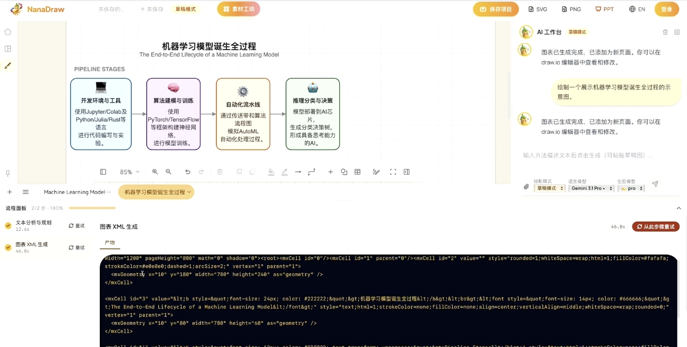
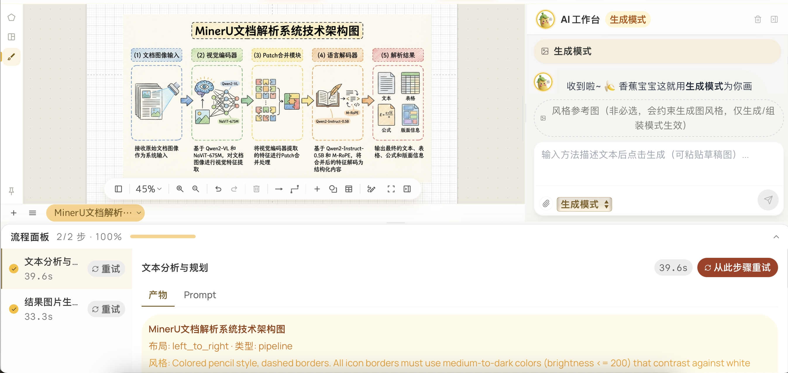
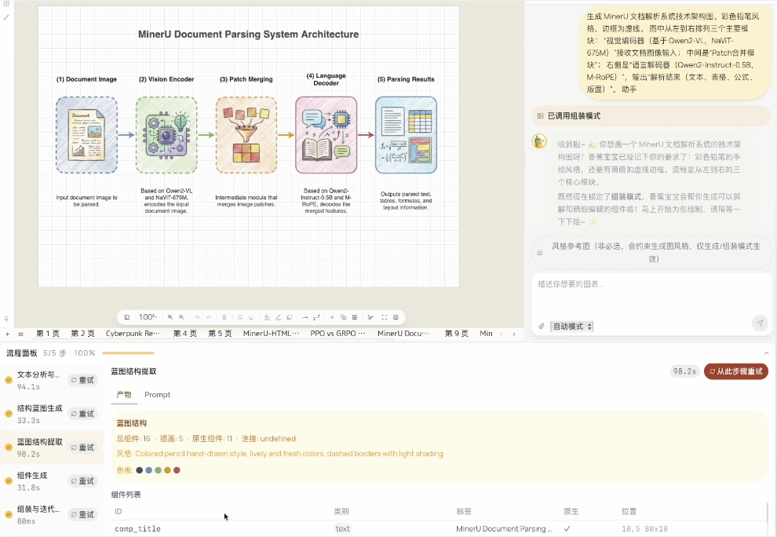

<div align="center">

# 🎨 NanaDraw

**Turn academic paper method descriptions into editable pipeline diagrams**

[简体中文](./README_zh-CN.md) | English

Demo Video: [Add video link here](#)

<!-- TODO: Add demo GIF here -->
<!--  -->

</div>

## Features

- 📝 Paste method description text → auto-generate pipeline diagrams
- 🎨 Three creation modes: Draft, Generation, and Assembly
- 🖼️ Built-in style gallery with 250+ academic paper reference images
- 🧰 Asset workshop with Bioicons, reusable personal assets, and AI-generated materials
- ✏️ Integrated draw.io editor for diagram fine-tuning
- 🤖 AI Assistant (NanaSoul) for natural language canvas manipulation
- 💾 Local project storage — no cloud required
- 🌐 Bilingual UI (Chinese/English)

### Creation Modes

| Mode | Description | Steps | Example Screenshot |
|------|-------------|-------|--------------------|
| Draft Mode | Editable XML sketch from text or hand-drawn input | 2 (Plan → XML) |  |
| Generation Mode | Direct visual concept image for inspiration and preview | 2 (Plan → Image) |  |
| Assembly Mode | Editable, style-aware illustration built through structured assembly | 5 (Plan → Image → Blueprint → Components → Assembly) |  |

### Draft Mode

Turn text descriptions or uploaded hand-drawn sketches into editable XML drafts quickly.

- Best when an idea has just appeared and you want to get it onto the canvas first.
- Enter a method description, a few keywords, or a rough concept, and NanaDraw produces an editable first-pass sketch.
- Think of it as a creative whiteboard: block out the structure now, then refine details, hierarchy, and wording later.
- Useful for brainstorming, rapid outlining, method mapping, and comparing alternative concepts.

### Generation Mode

Use the Nano Banana model family to generate a complete visual concept image for posters, inspiration, or fast previews.

- Best when you want a compelling result from a single sentence or a short prompt.
- Provide a topic, structural hints, and style preferences, and the system creates a full visual composition directly.
- This mode emphasizes visual impact, overall atmosphere, and creative expression.
- When you are not sure how the final figure should look yet, it can give you several strong directions to react to.

### Assembly Mode

Run NanaDraw's structured assembly pipeline to generate an editable visual illustration that can also be exported to PPT for further refinement.

- Best for formal figures that need to look polished while staying precise and controllable.
- The system first understands the structural relationships in your description, then assembles modules, components, and layout step by step.
- This mode emphasizes accurate generation from the description while keeping module boundaries clear, structure tidy, and downstream editing easy.
- It balances creativity with the clarity and consistency expected in paper figures, architecture diagrams, and multi-stage workflows.
- If Generation Mode feels like an idea burst, Assembly Mode is the stage where that idea is refined into something ready to present or publish.

### Asset Workshop

The built-in asset workshop combines Bioicons, user-managed assets, and AI-generated materials.

- It works like a ready-to-use parts library, so you do not have to start every figure from zero.
- You can build your own reusable collection of icons, components, and visual elements that becomes more useful over time.
- AI asset generation lets you describe what you want or provide a reference direction to create new icons, illustrations, and reusable visual components.
- When generic icons are not enough or existing assets do not match the idea closely, the workshop turns "what I want" into "what I can use right now."

### Gallery & Icons

- **Gallery**: Download reference images: `python scripts/download_gallery.py`
- **Bioicons**: Download SVG icons: `python scripts/download_bioicons.py`

Both are optional. Docker images include all data pre-installed.

## Install & Deploy

### Prerequisites

- Python >= 3.10
- Node.js >= 18
- pnpm (`npm install -g pnpm`)
- An LLM API key (Gemini, OpenAI, or compatible)

### One-Click Start

```bash
git clone https://github.com/opennanadraw/opennanadraw.git
cd opennanadraw
python start.py
```

The script will:
1. Install Python and Node.js dependencies
2. Optionally download gallery images and bioicons
3. Build the frontend
4. Start the server and open your browser

### Development Mode

```bash
python start.py --dev
```

This starts both the Vite dev server and the backend API server.

### Docker

```bash
# Standard
docker build -f docker/Dockerfile -t nanadraw .
docker run -p 8001:8001 nanadraw

# China mirror (faster for CN users)
docker build -f docker/Dockerfile.cn -t nanadraw .
docker run -p 8001:8001 nanadraw
```

### Configuration

After starting, click the ⚙️ gear icon in the top-right corner to configure:

- **API Key**: Your LLM provider API key
- **API Base URL**: Custom endpoint (leave empty for default)
- **Text Model**: Default `gemini-2.5-pro-preview-06-05`
- **Image Model**: Default `gemini-2.0-flash-preview-image-generation`
- **NanaSoul**: Custom AI persona for style constraints

## Architecture

```
nanadraw/
├── frontend/          # React + TypeScript + Vite + TailwindCSS
│   └── src/
├── backend/           # FastAPI + Python
│   ├── app/
│   │   ├── api/       # REST API endpoints
│   │   ├── services/  # Business logic + pipeline orchestration
│   │   ├── prompts/   # LLM prompt templates
│   │   └── static/    # Gallery + Bioicons data
│   └── requirements.txt
├── drawio/            # draw.io fork (Apache-2.0)
├── scripts/           # Data download scripts
├── start.py           # One-click startup
└── docker/            # Docker configurations
```

## Contributing

<!-- TODO: Add contribution guidelines -->

See [CONTRIBUTING.md](./CONTRIBUTING.md) for development guidelines.

## License

<!-- TODO: Choose and add license -->

This project is licensed under [LICENSE_NAME] - see the [LICENSE](./LICENSE) file for details.

The draw.io fork is licensed under Apache-2.0.

## Acknowledgments

- [draw.io](https://github.com/jgraph/drawio) — Diagram editor
- [Bioicons](https://github.com/duerrsimon/bioicons) — Science SVG icons
- [PaperGallery](https://github.com/LongHZ140516/PaperGallery) — Reference images
