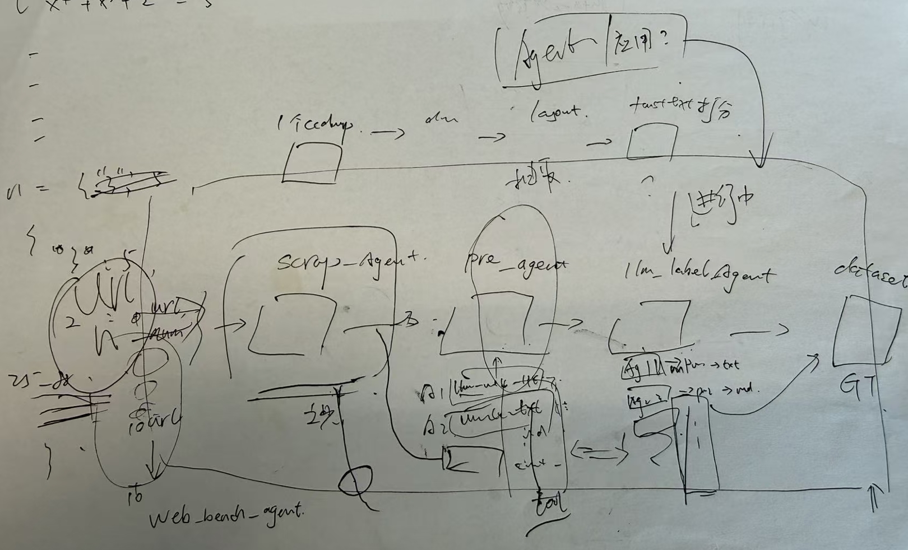
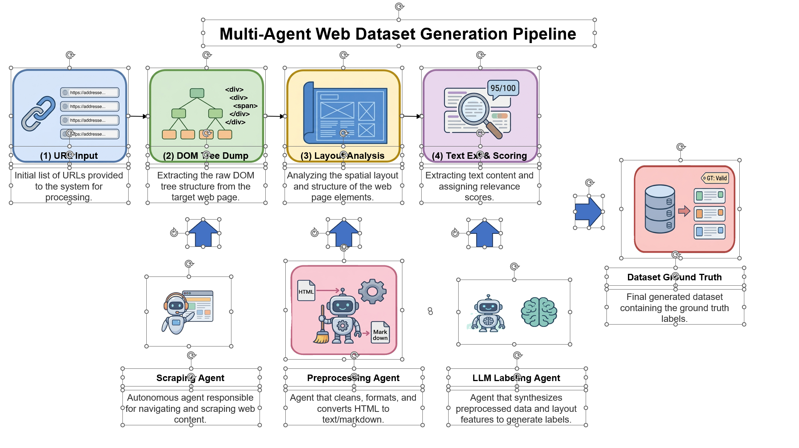

<div align="center">


# NanaDraw

**将学术论文中的方法描述转换为可编辑的流程图**

简体中文 | [English](./README.md)

[演示视频](https://www.youtube.com/watch?v=_awu_jQiSFQ)

👋 join us on [WeChat](./docs/material/wechat_group_qr.jpg)

</div>

## 功能特性

- 📝 粘贴方法描述文本，自动生成流程图
- 🎨 三种创作模式：草稿模式、生成模式、组装模式
- 🖼️ 内置 250+ 学术论文风格参考图
- 🧰 素材工坊集成 Bioicons、个人常用素材和 AI 生成素材
- ✏️ 内嵌 draw.io 编辑器，便于后续微调
- 🤖 AI 助手（NanaSoul）支持自然语言画布操作
- 💾 本地项目存储，无需云端依赖
- 🌐 中英双语界面

### 示例场景

上传手绘草图，一键生成高保真、可编辑的流程图。

| 图1：草图 | 图2：可编辑流程图 |
|-----------|-------------------|
|  |  |

图 1 为用户上传的手绘草图，图 2 为系统生成的高保真可编辑流程图。

### 多种模式

| 模式 | 说明 | 步骤 | 示例截图 |
|------|------|------|----------|
| 草稿模式 | 根据文字或手绘输入生成可编辑 XML 草图 | 2（Plan → XML） | [查看截图](./image/draft_mode.jpg) |
| 生成模式 | 直接生成完整视觉概念图，用于灵感探索和预览 | 2（Plan → Image） | [查看截图](./image/generation_mode.jpg) |
| 组装模式 | 通过结构化组装流程生成可编辑、带风格控制的视觉插图 | 5（Plan → Image → Blueprint → Components → Assembly） | [查看截图](./image/assembly_mode.jpg) |

### 模式预览

**草稿模式**


**生成模式**


**组装模式**


### 草稿模式

快速将文字描述或上传的手绘草图转换成可编辑 XML 草图。

- 适合灵感刚出现时，先把想法落到画布上。
- 输入一段方法描述、几个关键词，或者一个粗略构想，NanaDraw 会先给出一版可编辑草图。
- 它更像一个创意白板，先帮你搭出整体结构，之后再慢慢补细节、调层级、改表达。
- 适合头脑风暴、快速起稿、方法梳理和不同方案比稿。

### 生成模式

调用 Nano Banana 系列模型，直接生成完整视觉概念图，可用于海报灵感、风格探索和快速预览。

- 适合想用一句话快速得到效果图的场景。
- 用户给出主题、结构提示和风格偏好后，系统会直接生成一张完整视觉图。
- 这一模式更强调画面感、整体氛围和创意表达。
- 当你还没想清楚最终图该怎么画时，它可以先给你几个足够有感觉的方向。

### 组装模式

使用 NanaDraw 的结构化组装流水线，一键生成可编辑视觉插图，并支持导出为 PPT 继续修改。

- 适合既要美观，又要求严谨、可控的正式作图场景。
- 系统会先理解描述里的结构关系，再按步骤组装模块、组件和版式。
- 这一模式更强调"按描述准确生成"，同时保证模块边界清晰、结构规整、后续易于编辑。
- 它兼顾创意表达，以及论文图、架构图、多阶段流程图对清晰度和规范性的要求。
- 如果说生成模式更像灵感爆发，组装模式就更像把创意打磨成可展示、可发表的正式作品。

### 素材工坊

内置素材工坊整合了 Bioicons、用户自定义素材以及 AI 生成素材。

- 它像一个随手可用的创意零件库，让你不用每次都从零开始画。
- 你可以逐步沉淀自己的常用图标、组件和视觉元素，越用越顺手。
- 通过 AI 素材生成，只需一句描述或一个参考方向，就能生成新的图标、插图和可复用视觉组件。
- 当通用图标不够用、现成素材又不够贴切时，素材工坊可以把"我想要什么"快速变成"我现在就能用什么"。

### 素材库与图标

- **Gallery**：下载风格参考图：`python scripts/download_gallery.py`
- **Bioicons**：下载 SVG 图标：`python scripts/download_bioicons.py`

这两部分都是可选资源，首次启动时会提示下载。

## 安装与部署

### 环境要求

- Python >= 3.10
- Node.js >= 18
- pnpm（`npm install -g pnpm`）
- 一个可用的 LLM API Key（Gemini、OpenAI 或兼容接口）

### 一键启动

```bash
git clone https://github.com/Shannon4Science/NanaDraw.git
cd NanaDraw
python start.py
```

脚本会自动完成以下操作：
1. 安装 Python 和 Node.js 依赖
2. 按需下载素材库图片和 Bioicons
3. 构建前端
4. 启动服务并打开浏览器

### 后台运行

> **注意**：首次使用请先在前台运行 `python start.py`，以完成依赖安装、素材下载等交互式步骤。初始化完成后，后续启动可使用后台模式：

```bash
nohup python start.py --skip-download > nanadraw.log 2>&1 &
```

`--skip-download` 会跳过交互式的数据下载提示，避免后台进程因等待输入而挂起。如需补充下载素材，请在前台单独运行：

```bash
python scripts/download_gallery.py
python scripts/download_bioicons.py
```

随时查看日志：`tail -f nanadraw.log`。停止进程：

```bash
kill $(cat nanadraw.pid 2>/dev/null || ps aux | grep 'start.py' | grep -v grep | awk '{print $2}')
```

### 开发模式

```bash
python start.py --dev
```

该模式会同时启动 Vite 开发服务器和后端 API 服务。

### 配置说明

启动后，点击右上角的 ⚙️ 设置按钮即可配置：

- **API Key**：你的 LLM 服务商 API Key
- **API Base URL**：自定义接口地址（留空则使用默认值）
- **文本模型**：默认 `gemini-3.1-pro-preview`
- **图像模型**：默认 `gemini-3-pro-image-preview`
- **组件模型**：默认 `gemini-3.1-flash-image-preview`
- **NanaSoul**：用于风格约束的自定义 AI 角色

#### 数据目录（环境变量）

NanaDraw 会将项目、素材和设置保存到本地数据目录。默认路径是 `~/.nanadraw`，可通过环境变量 `NANADRAW_DATA_DIR` 自定义：

```bash
# macOS / Linux
export NANADRAW_DATA_DIR="$HOME/nanadraw-data"
python start.py
```

```powershell
# Windows PowerShell
$env:NANADRAW_DATA_DIR="$HOME\\nanadraw-data"
python start.py
```

## 架构概览

```
NanaDraw/
├── frontend/          # React + TypeScript + Vite + TailwindCSS
│   └── src/
├── backend/           # FastAPI + Python
│   ├── app/
│   │   ├── api/       # REST API endpoints
│   │   ├── services/  # Business logic + pipeline orchestration
│   │   ├── prompts/   # LLM prompt templates
│   │   └── static/    # Gallery + Bioicons data
│   └── requirements.txt
├── drawio/            # draw.io fork (Apache-2.0)
├── scripts/           # Data download scripts
└── start.py           # One-click startup
```

## 贡献

<!-- TODO: Add contribution guidelines -->

开发规范请参考 [CONTRIBUTING.md](./CONTRIBUTING.md)。

## 许可证

本项目基于 Apache License 2.0 修改版本进行许可，并附加额外条件。详见 [LICENSE](./LICENSE_zh-CN)。（[English](./LICENSE)）

draw.io fork 部分遵循 Apache-2.0 许可证。

## 致谢

- [draw.io](https://github.com/jgraph/drawio) — 图表编辑器
- [Bioicons](https://github.com/duerrsimon/bioicons) — 科学类 SVG 图标
- [PaperGallery](https://github.com/LongHZ140516/PaperGallery) — 风格参考图来源
